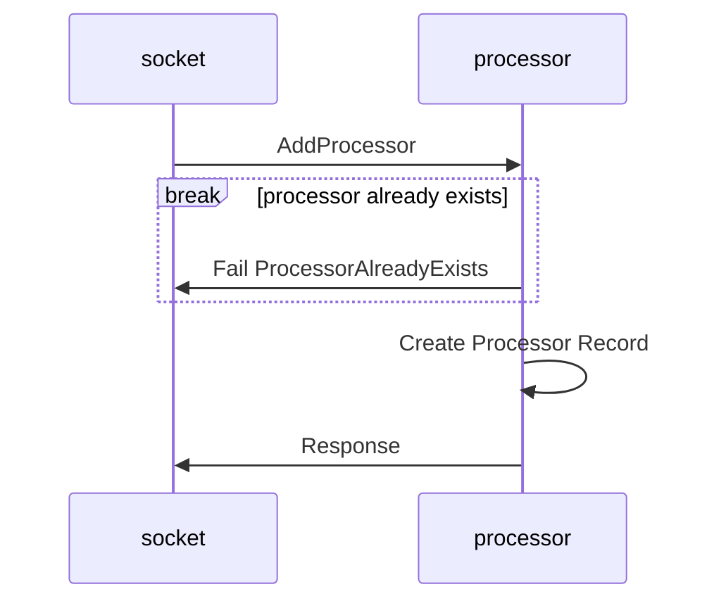
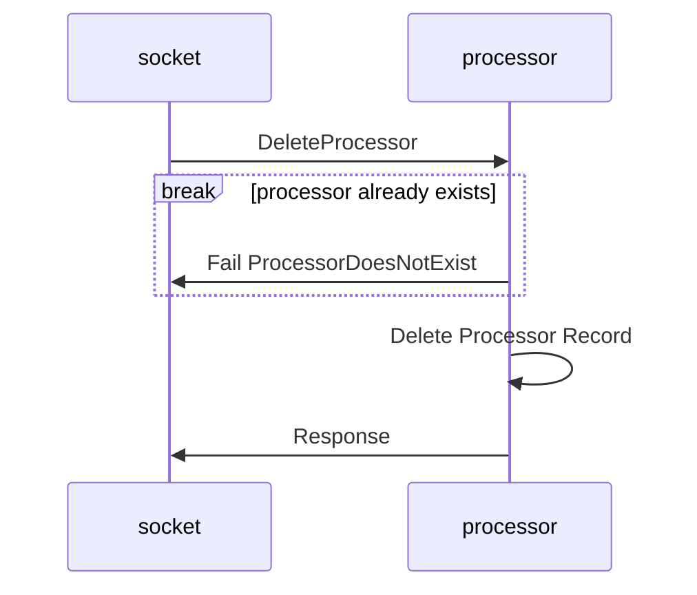
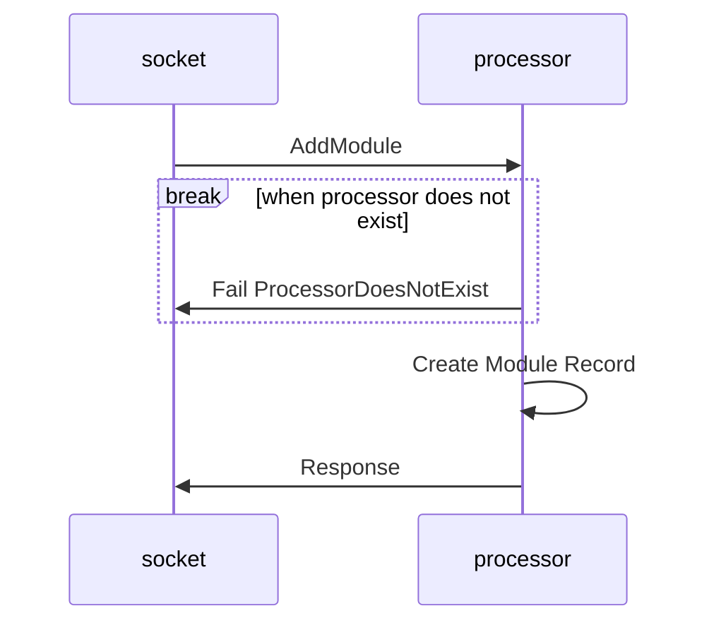
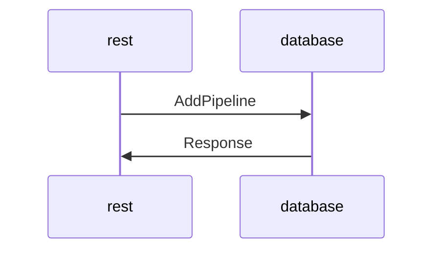
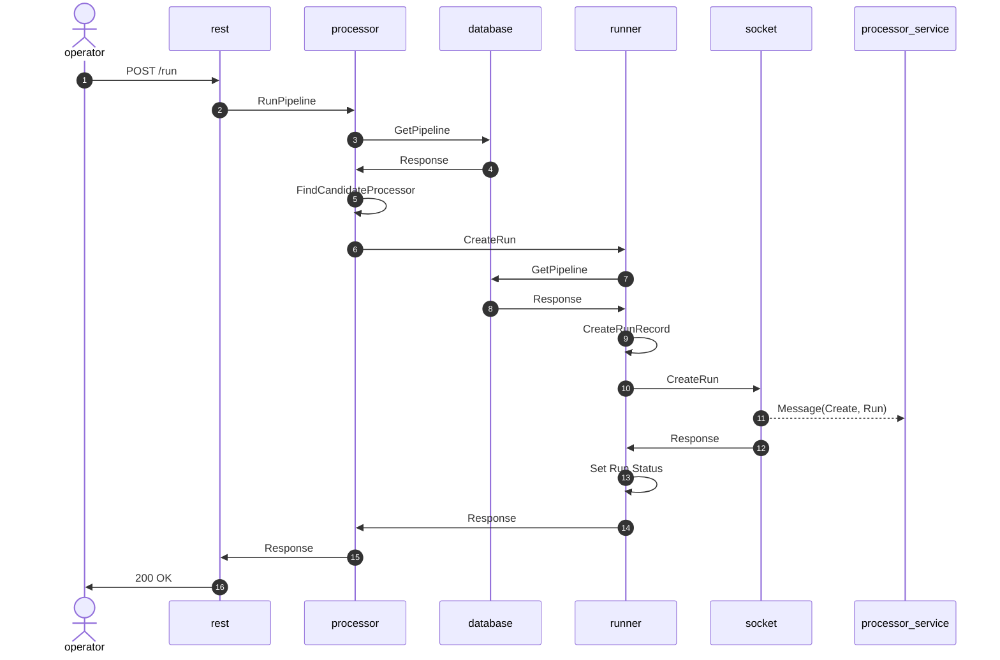
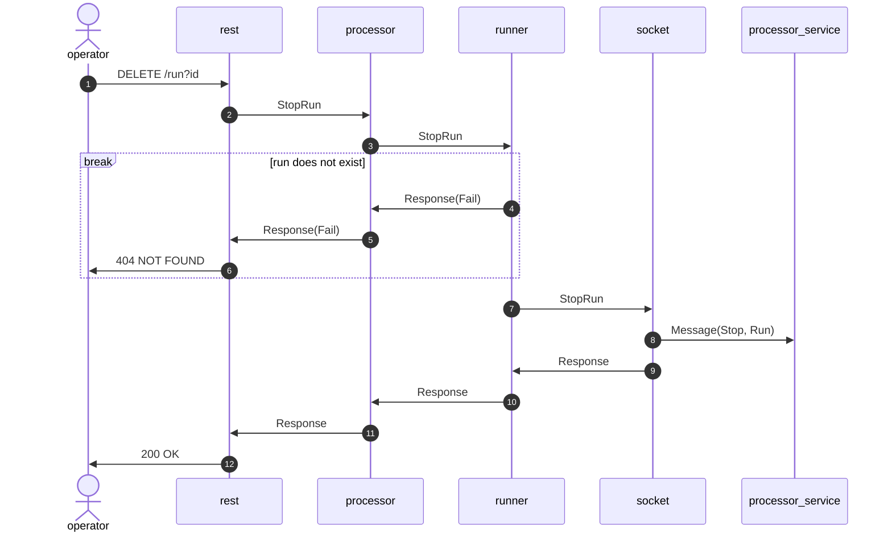
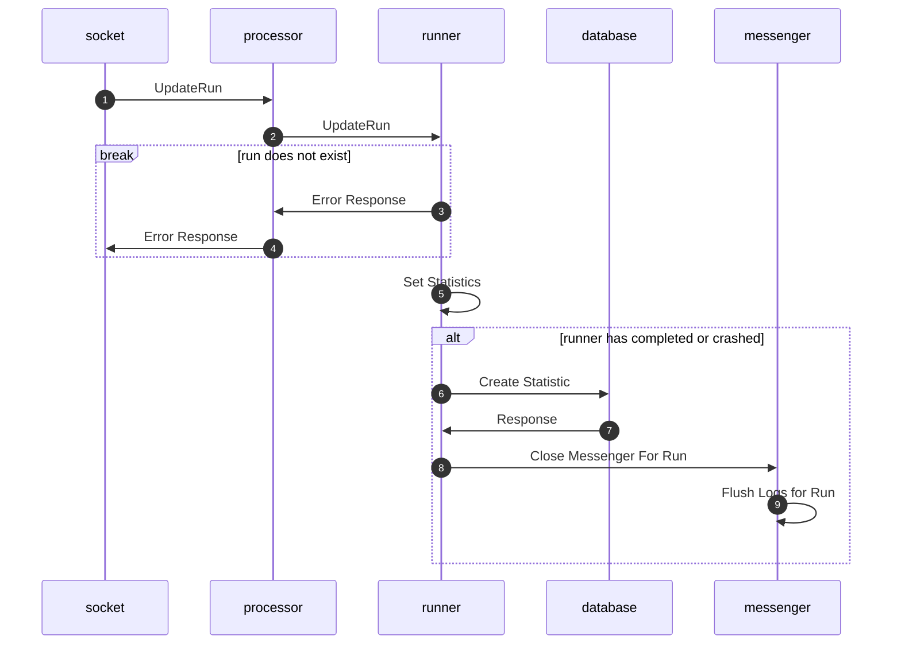

# core architecture decisions

## thread arrangement

## procedures

### Processor Connects to Core

### Processor Disconnects from Core

### Processor Registers Module

### Create Pipeline

### Start Run

### Stop Run

### Update Run

