# Sequence Flows

## Processors

### Get Processor

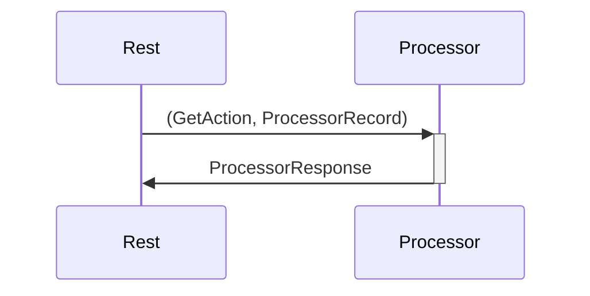
```mermaid
sequenceDiagram
    Rest->>+Processor : (GetAction, ProcessorRecord)
    Processor->>-Rest : ProcessorResponse
```

### Add Processor

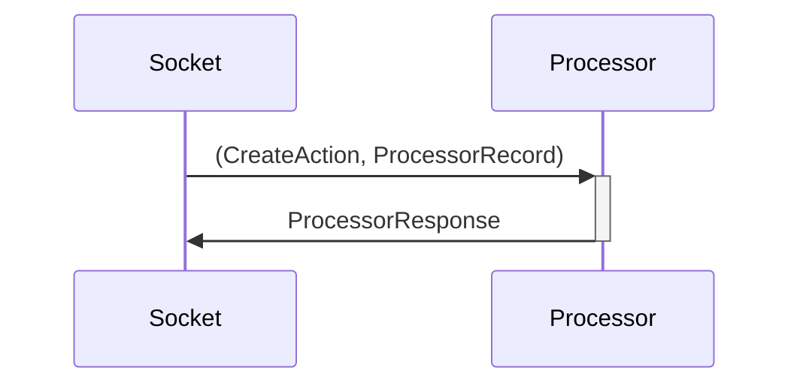
```mermaid
sequenceDiagram
    Socket->>+Processor : (CreateAction, ProcessorRecord)
    Processor->>-Socket : ProcessorResponse
```

### Delete Processor

```mermaid
sequenceDiagram
    Socket->>+Processor : (DeleteAction, ProcessorRecord)
    Processor->>-Socket : ProcessorResponse
```

## Functions

### Get Functions

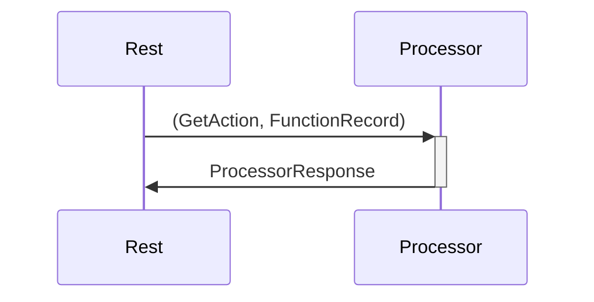
```mermaid
sequenceDiagram
    Rest->>+Processor : (GetAction, FunctionRecord)
    Processor->>-Rest : ProcessorResponse
```

### Mount Function

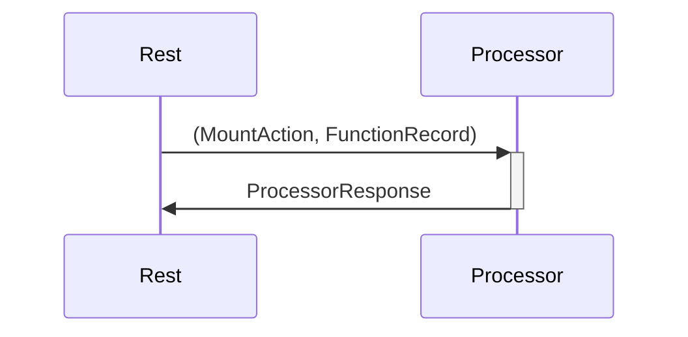
```mermaid
sequenceDiagram
    Rest->>+Processor : (MountAction, FunctionRecord)
    Processor->>-Rest : ProcessorResponse
```

### Unmount Function

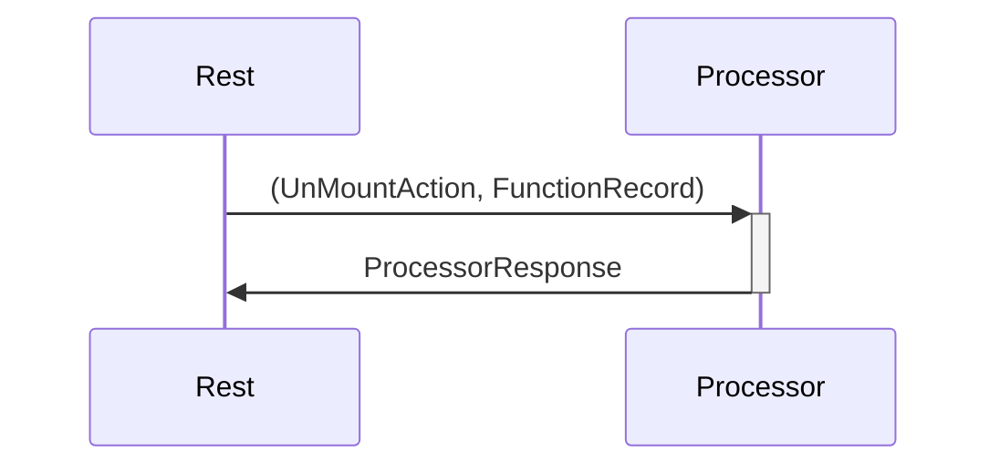
```mermaid
sequenceDiagram
    Rest->>+Processor : (UnMountAction, FunctionRecord)
    Processor->>-Rest : ProcessorResponse
```

## Runs

### Create Run

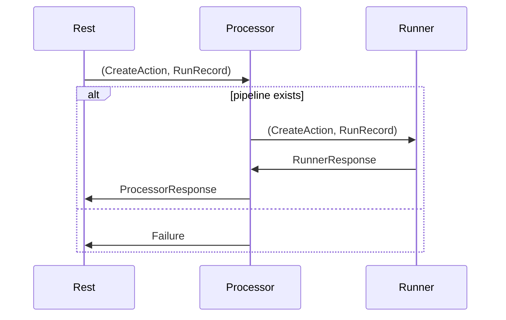
```mermaid
sequenceDiagram
    Rest->>Processor : (CreateAction, RunRecord)
    alt pipeline exists
        Processor->>Runner : (CreateAction, RunRecord)
        Runner->>Processor : RunnerResponse
        Processor->>Rest : ProcessorResponse
    else
        Processor->>Rest : Failure
    end
```

### Get Run

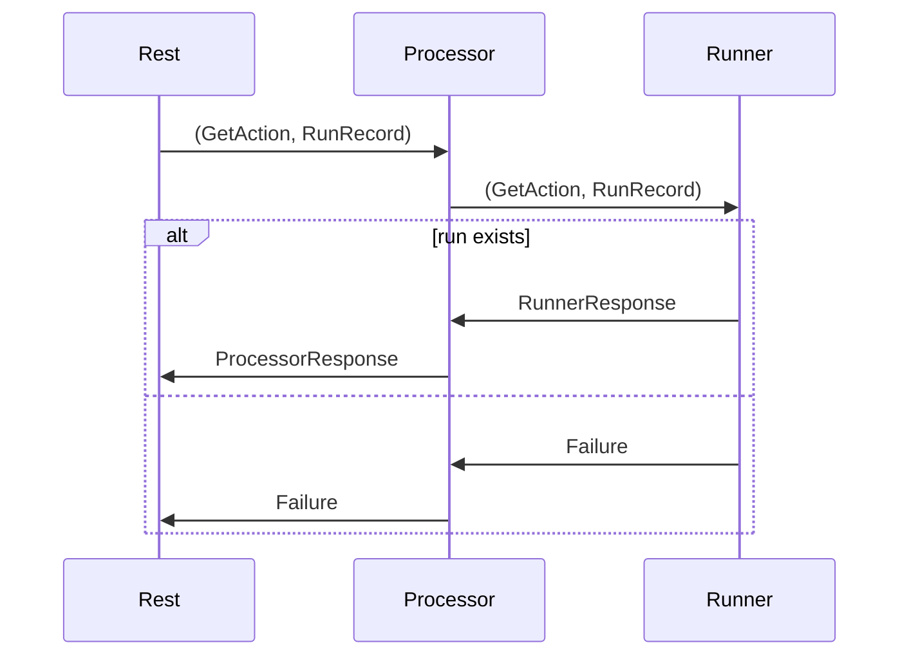
```mermaid
sequenceDiagram
    Rest->>Processor : (GetAction, RunRecord)
    Processor->>Runner : (GetAction, RunRecord)
    alt run exists
        Runner->>Processor : RunnerResponse
        Processor->>Rest : ProcessorResponse
    else
        Runner->>Processor : Failure
        Processor->>Rest : Failure
    end
```

### Update Run

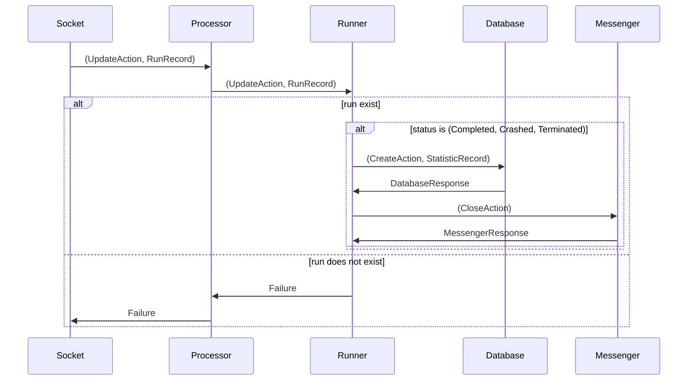
```mermaid
sequenceDiagram
    Socket->>Processor : (UpdateAction, RunRecord)
    Processor->>Runner : (UpdateAction, RunRecord)
    alt run exist
        alt status is (Completed, Crashed, Terminated)
            Runner->>Database : (CreateAction, StatisticRecord)
            Database->>Runner : DatabaseResponse
            Runner->>Messenger : (CloseAction)
            Messenger->>Runner : MessengerResponse
        else
         end
    else run does not exist
        Runner->>Processor : Failure
        Processor->>Socket : Failure
    end
```

### Stop Run

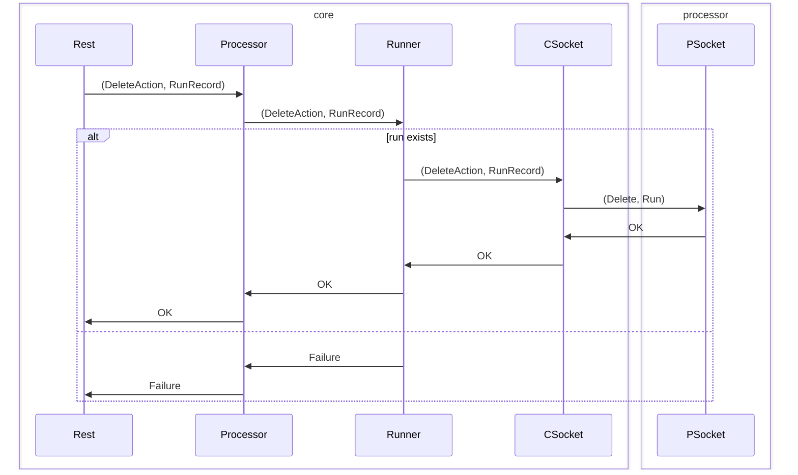
```mermaid
sequenceDiagram
    box core
        participant Rest
        participant Processor
        participant Runner
        participant CSocket
    end
    box processor
        participant PSocket
    end
    Rest->>Processor : (DeleteAction, RunRecord)
    Processor->>Runner : (DeleteAction, RunRecord)
    alt run exists
        Runner->>CSocket : (DeleteAction, RunRecord)
        CSocket->>PSocket : (Delete, Run)
        PSocket->>CSocket : OK
        CSocket->>Runner : OK
        Runner->>Processor : OK
        Processor->>Rest : OK
    else
        Runner->>Processor : Failure
        Processor->>Rest : Failure
    end
```

## Statistics

### Get Statistics

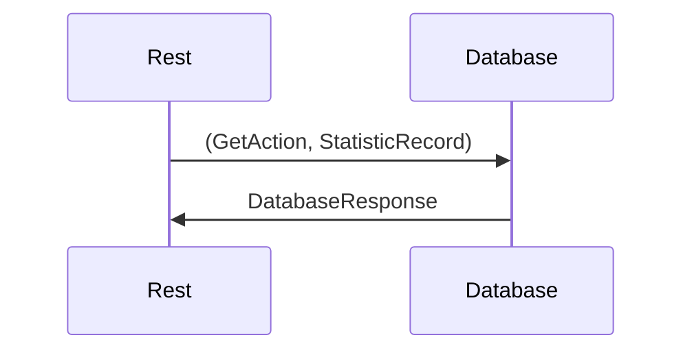
```mermaid
sequenceDiagram
    Rest->>Database : (GetAction, StatisticRecord)
    Database->>Rest : DatabaseResponse
```

## Modules

### Get Modules

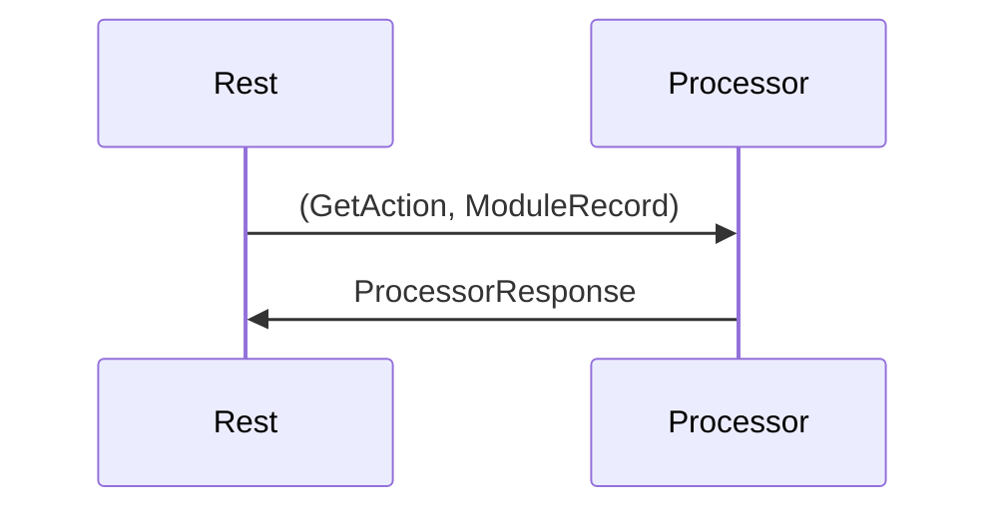
```mermaid
sequenceDiagram
    Rest->>Processor : (GetAction, ModuleRecord)
    Processor->>Rest : ProcessorResponse
```

### Add Module

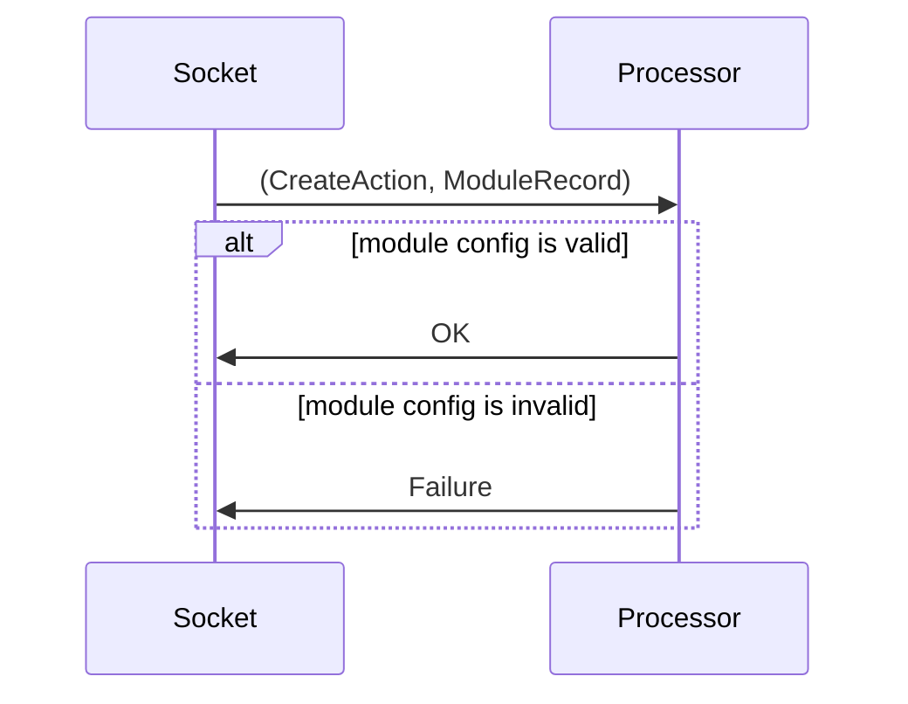
```mermaid
sequenceDiagram
    Socket->>Processor : (CreateAction, ModuleRecord)
    alt module config is valid
        Processor->>Socket : OK
    else module config is invalid
        Processor->>Socket : Failure
    end
```

### Mount Module

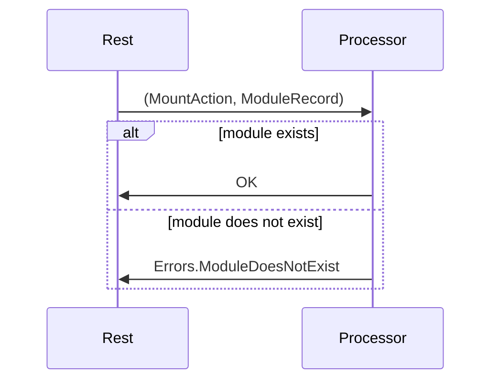
```mermaid
sequenceDiagram
    Rest->>Processor : (MountAction, ModuleRecord)
    alt module exists
        Processor->>Rest : OK
    else module does not exist
        Processor->>Rest : Errors.ModuleDoesNotExist
    end
```

### UnMount Module

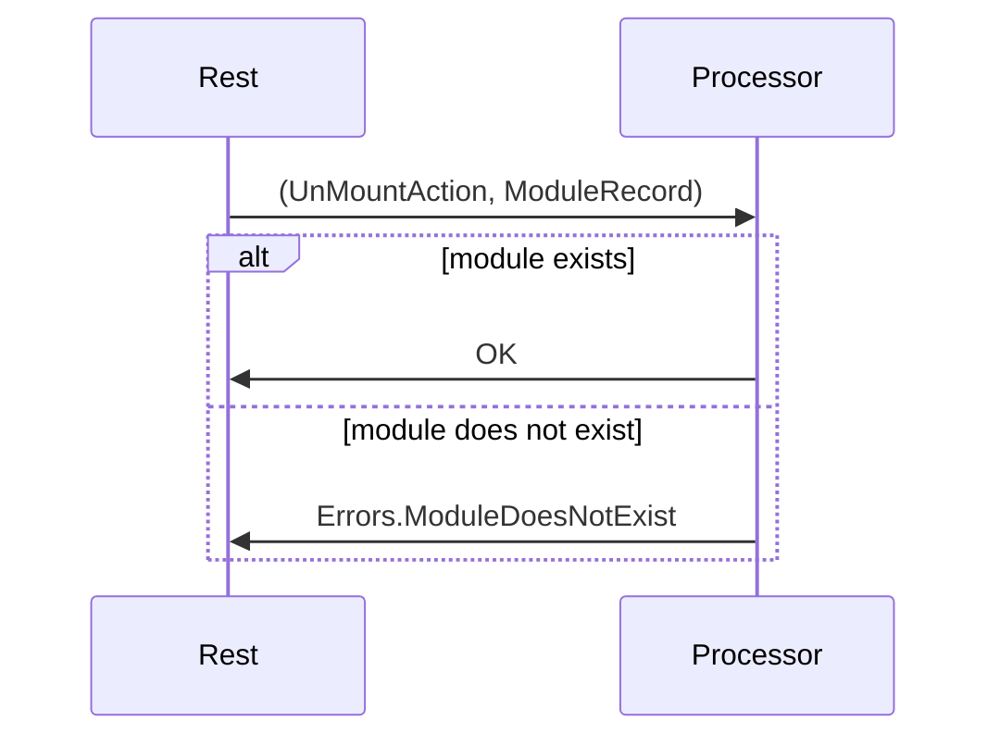
```mermaid
sequenceDiagram
    Rest->>Processor : (UnMountAction, ModuleRecord)
    alt module exists
        Processor->>Rest : OK
    else module does not exist
        Processor->>Rest : Errors.ModuleDoesNotExist
    end
```

## Jobs

### Get Jobs

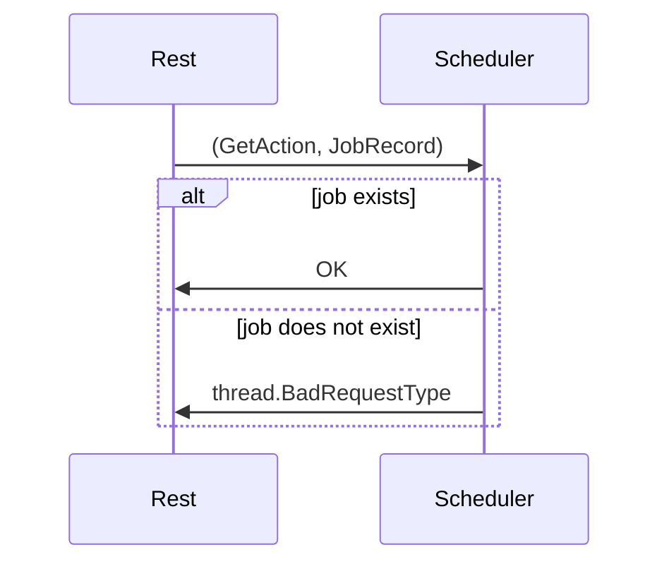
```mermaid
sequenceDiagram
    Rest->>Scheduler : (GetAction, JobRecord)
    alt job exists
        Scheduler->>Rest : OK
    else job does not exist
        Scheduler->>Rest : thread.BadRequestType
    end
```

### Create Job

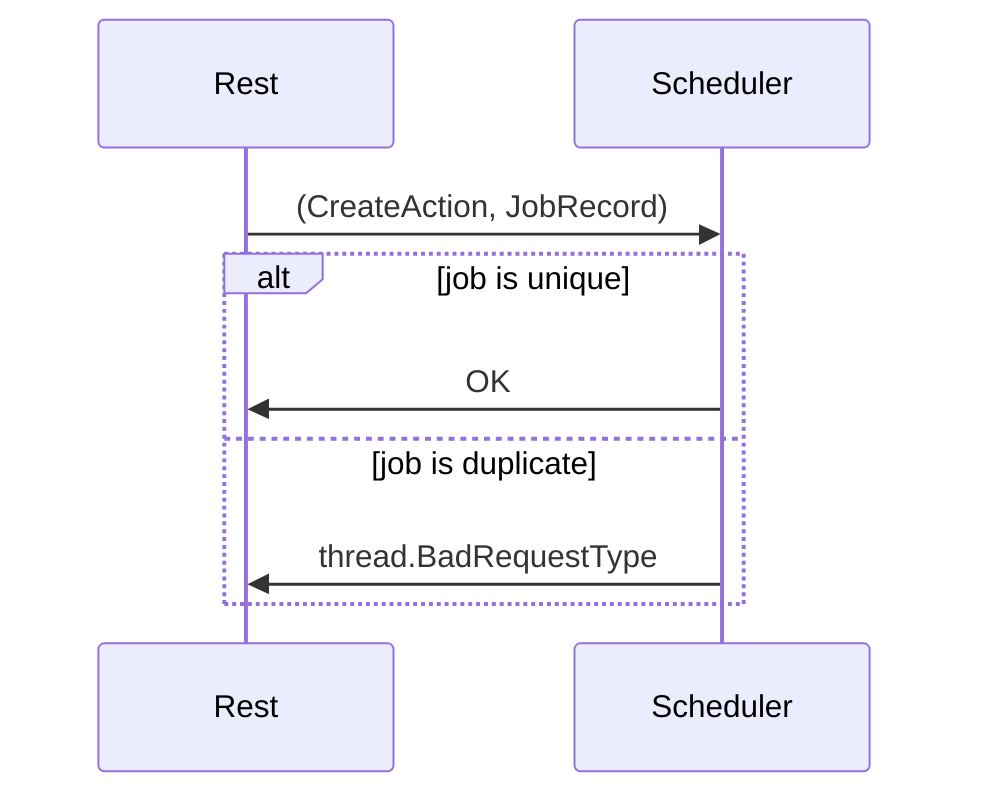
```mermaid
sequenceDiagram
    Rest->>Scheduler : (CreateAction, JobRecord)
    alt job is unique
        Scheduler->>Rest : OK
    else job is duplicate
        Scheduler->>Rest : thread.BadRequestType
    end
```

### Delete Job

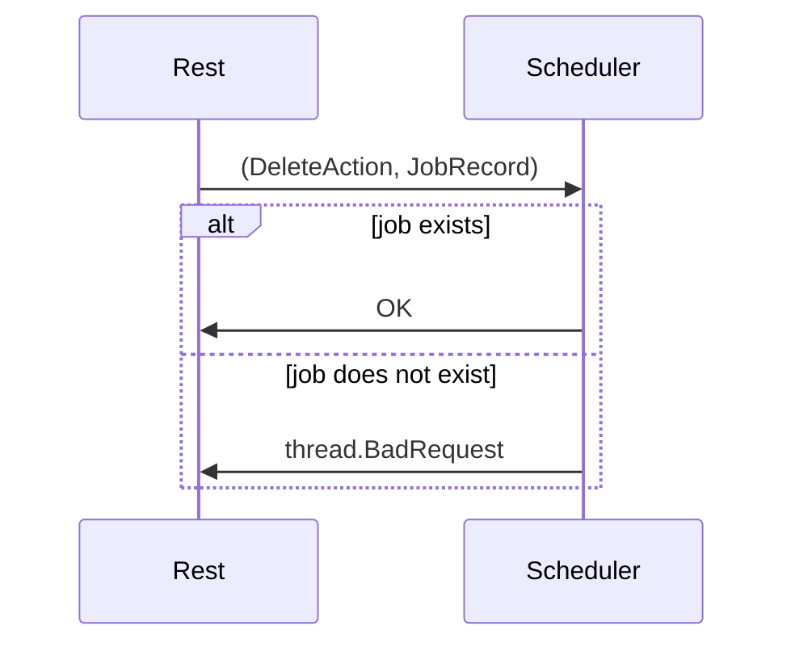
```mermaid
sequenceDiagram
    Rest->>Scheduler : (DeleteAction, JobRecord)
    alt job exists
        Scheduler->>Rest : OK
    else job does not exist
        Scheduler->>Rest : thread.BadRequest
    end
```

### Get Queue

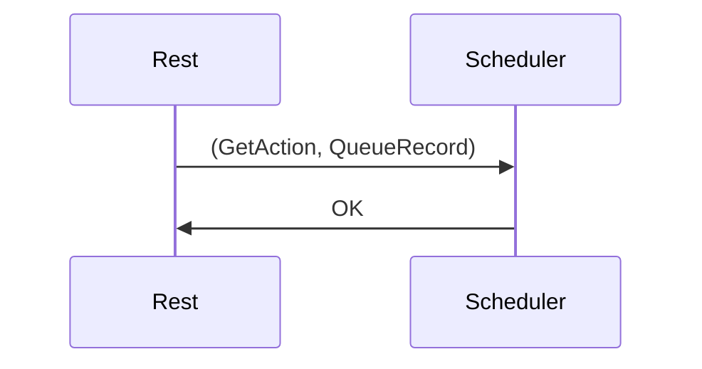
```mermaid
sequenceDiagram
    Rest->>Scheduler : (GetAction, QueueRecord)
    Scheduler->>Rest : OK
```